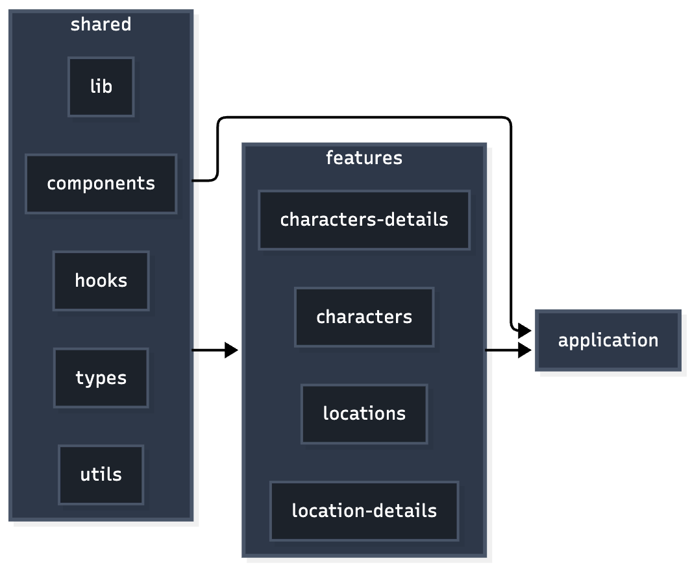

# Architecture

This doc covers how the app is structured and why certain decisions were made.

## Overview

The architecture combines feature-based modules with Atomic Design for components. Feature modules (`src/features/`) keep related code together - API calls, hooks, and feature-specific components all live in the same place. Shared UI components (`src/components/`) follow Atomic Design loosely: atoms are basic elements like buttons and badges, molecules combine atoms into things like cards, and organisms are larger sections like grids and navigation.

TypeScript is used everywhere for type safety, and there are 67 tests covering components, hooks, and full feature workflows.

## File Structure

```
src/
├── components/           # Shared UI (Atomic Design)
│   ├── atoms/           # Button, Badge, Card
│   ├── molecules/       # CharacterCard, LocationCard, SpoilerToggle
│   └── organisms/       # CharacterGrid, LocationGrid, Navigation
├── features/            # Feature modules
│   ├── characters/
│   │   ├── api/        # Server-side aggregations
│   │   ├── components/ # Feature charts
│   │   └── hooks/      # Data fetching
│   └── locations/
├── lib/                 # Shared utilities
│   └── apollo/         # GraphQL client
├── stores/              # Zustand state
├── types/               # TypeScript definitions
└── utils/               # Helper functions

tests/
├── unit/                # Component & hook tests
├── integration/         # Feature tests
└── utils/               # Test mocks
```



## Component Organization

The Atomic Design pattern here is flexible, not strict. The goal is separating truly reusable primitives from feature-specific components.

Atoms (`src/components/atoms/`) are the basic building blocks - buttons, badges, cards. They're stateless, accept props for customization, and support `className` merging for style overrides.

Molecules (`src/components/molecules/`) combine atoms. `CharacterCard` pulls spoiler state from the Zustand store. `SpoilerToggle` handles click-outside detection. These are still generic enough to reuse across pages.

Organisms (`src/components/organisms/`) are larger sections that handle full workflows. `CharacterGrid` and `LocationGrid` manage infinite scroll with Intersection Observer, fetch data with Apollo, and handle loading/error/empty states. They're the building blocks of pages.

Feature-specific components live in `src/features/`. For example, the species and status charts only make sense in the characters feature, so they're in `src/features/characters/components/`.

This isn't the only way to organize components - you could also use a pattern like `src/ui/` for primitives, `src/components/` for composable pieces, and `src/features/` for page-level stuff. Pick whatever makes sense for your team.

## Data Management

Apollo Client (`src/lib/apollo/apollo-client.ts`) handles GraphQL queries and caching. The cache is configured for infinite scroll with `keyArgs: ["filter"]` to keep separate caches per search query, and custom merge functions that append results for pagination but reset on page 1.

The API doesn't provide aggregation endpoints, so character/location counts are computed server-side in Next.js Server Components. See `src/features/characters/api/count-status.ts` and `count-species.ts` - they fetch all pages and aggregate on the server. This means zero client JavaScript for the analytics page.

For production at scale, you'd move this to a BFF layer with Redis caching instead of computing on every request.

## State Management

Zustand (`src/stores/useUIStore.ts`) manages UI state: which modal is open, search query, spoiler mode, and which characters have been revealed. It's 1.2 KB vs Redux's 12 KB, has built-in persistence middleware, and doesn't need actions/reducers.

Spoiler state is persisted to localStorage using Zustand's persist middleware. Since the middleware requires serializable data, `revealedCharacters` is stored as an array but used as a Set in the app (converted on load/save).

## Styling

Tailwind CSS 4 with custom design tokens in `app/globals.css`. Colors, spacing, and other values are defined as CSS variables, making it easy to update the design system. Tailwind generates utility classes at build time with zero runtime overhead.

## Testing

67 tests split between unit tests (components, hooks, utilities) and integration tests (feature workflows with Apollo mocks).

Test utilities in `tests/utils/`:
- `apollo-mocks.ts` - Reusable GraphQL mock responses
- `test-utils.tsx` - Custom render function with Apollo provider

Tests focus on user behavior rather than implementation details. Cover critical paths, error states, loading states, and edge cases like empty results.

## Code Quality

Biome handles linting and formatting. It's 10-20x faster than ESLint + Prettier and uses a single config file. Husky runs Biome and the test suite on every commit via `.husky/pre-commit`.

TypeScript strict mode catches errors at compile time.

## Performance

Server Components run aggregations on the server, so the analytics page ships zero JavaScript for data fetching.

Infinite scroll uses Intersection Observer instead of scroll event listeners, which is more performant.

Apollo Client's cache-first policy loads pages instantly from cache when available.

Next.js automatically code-splits by route.

Images use Next.js Image component for automatic WebP conversion, lazy loading, and responsive srcsets.

## Key Decisions

### Apollo Client vs React Query

Went with Apollo Client because it's built for GraphQL - native query language support, normalized caching, and solid DevTools. The tradeoff is bundle size (45 KB vs 12 KB for React Query) and more complex configuration. For a REST API, React Query would make more sense.

### Zustand vs Redux

Zustand for its simpler API and smaller bundle. The whole state is defined in one place without actions, reducers, or middleware boilerplate. Tradeoff is less structure and a smaller ecosystem. For complex domain logic with lots of derived state, Redux might be better.

### Server-Side Aggregation

Next.js Server Components let us run aggregations on the server and avoid shipping that logic to the client. The downside is we have to fetch ALL characters to compute counts, which is slow. The API doesn't provide aggregation endpoints. In production, you'd build a BFF layer with a database and pre-compute these values.

### localStorage for Spoiler State

Client-side state with localStorage persistence is simple and doesn't require auth. Tradeoff is state is lost on new devices or if localStorage is cleared. A server-backed solution would require user accounts, which felt like overkill for this feature.

### Feature-Based + Atomic Hybrid

Shared atoms like Button and Badge are reusable everywhere. Features keep domain logic isolated - all character-related code lives in `src/features/characters/`. The tradeoff is developers need to learn where things go. A pure feature-based structure would duplicate common components across features.

## Priorities

This architecture optimizes for:
- Developer experience (fast tooling, clear structure, TypeScript)
- Performance (server components, caching, lazy loading)
- Maintainability (separation of concerns, comprehensive tests)
- Scalability (feature modules, reusable components)

For future improvements, see [EVOLUTION.md](./EVOLUTION.md).
